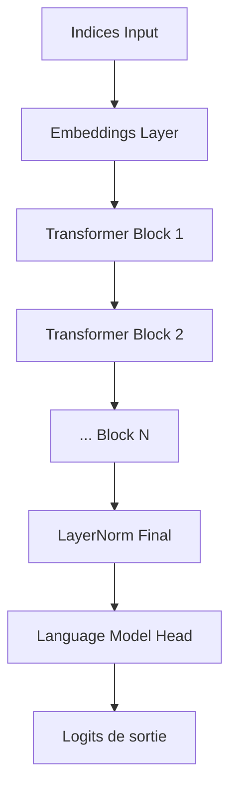
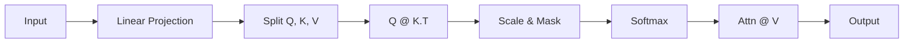

# ⚡️ NanoGPT "From Scratch" sur Apple MLX

Implémentation d'un Transformer de type GPT-2 (Decoder-only) utilisant le framework **MLX**.
L'objectif de ce projet est de comprendre l'architecture interne des LLM et d'exploiter l'accélération matérielle des puces Apple Silicon (M1/M2/M3/M4/M5) via l'API Metal, sans passer par la lourdeur de PyTorch/CUDA.

## 🛠 Stack Technique & Prérequis
* **Langage :** Python 3.x
* **Framework :** Apple MLX (pour l'accès bas niveau à la mémoire unifiée).
* **Architecture :** GPT-2 (Small config).
* **Tokenization :** Character-level (pour la simplicité d'implémentation).

---

## 1. Pourquoi MLX ? (Spécificités Hardware)

Contrairement à une approche classique où l'on gère manuellement les transferts CPU $\leftrightarrow$ GPU (`.to(device)`), MLX repose sur l'architecture **Unified Memory** d'Apple.

Dans mon code (`Phase 0`), on remarque deux concepts clés :
1.  **Lazy Evaluation :** Les opérations comme `c = a + b` ne sont pas calculées immédiatement. MLX construit un graphe de calcul et ne l'exécute que lors de l'appel explicite à `mx.eval()`. Cela permet au compilateur d'optimiser les kernels Metal.
2.  **Unified Arrays :** Les `mx.array` résident dans la même mémoire adressable par le CPU et le GPU. Zéro copie = latence minimale.

---

## 2. Architecture du Modèle

Le modèle est un **Transformer Decoder-only** classique. Il prend une séquence d'indices en entrée et prédit le prochain token.

### Flux de données (Dataflow)

---

## 3. Implémentation Détaillée

### 3.1 Embeddings (`Phase 5`)

Le réseau de neurones ne traite pas des strings, mais des vecteurs continus.

* **Token Embeddings (`wte`)** : Look-up table qui associe chaque caractère (ex: 'a') à un vecteur dense de dimension 128 (`n_embd`).
* **Position Embeddings (`wpe`)** : Indispensable car l'attention est invariante par permutation. On ajoute un vecteur représentant la position  (0, 1, 2...) au vecteur du token.
* **Règle :** `x = wte(idx) + wpe(pos)`

### 3.2 Self-Attention : Le mécanisme clé (`Phase 2`)

C'est ici que la "magie" contextuelle opère. Contrairement à un RNN qui lit séquentiellement, l'attention permet à chaque token de "regarder" tous les tokens précédents pour enrichir sa représentation.

J'ai implémenté l'attention causale (masked) manuellement pour la compréhension :

1. **Projections :** L'entrée  est projetée en 3 matrices : Query (), Key (), et Value ().
2. **Score d'attention :** On calcule le produit scalaire entre  et . Plus le score est haut, plus les tokens sont liés.
3. **Scaling & Masque :**
* Division par  pour stabiliser les gradients.
* Application d'un masque triangulaire inférieur () pour empêcher le modèle de tricher en regardant les mots futurs.

4. **Agrégation :** Somme pondérée des Values ().

**La formule implémentée :**

### 3.3 MLP : Feed Forward Network (`Phase 3`)

Après l'agrégation d'information par l'attention, chaque token passe par un réseau dense indépendant.

* Expansion :  (`4 * n_embd`).
* Activation : **GELU** (Gaussian Error Linear Unit), standard dans les LLM modernes (plus lisse que ReLU).
* Projection : .

### 3.4 Le Bloc Transformer & Résidus (`Phase 4`)

L'assemblage final utilise des **connexions résiduelles** (Skip connections).
Code : `x = x + self.attn(self.ln_1(x))`

Cela permet au gradient de fluer sans encombre lors de la backpropagation ("Gradient Superhighway"), résolvant le problème de *vanishing gradient* sur les réseaux profonds. Notez l'utilisation de **Pre-Norm** (LayerNorm appliqué *avant* l'attention/MLP), standard depuis GPT-2 pour la stabilité.

---

## 4. Inférence (Génération)

La méthode `generate` (`Phase 6`) exécute le modèle de manière **auto-régressive** :

1. Le modèle prend le contexte (ex: "Hell").
2. Il sort des logits pour le prochain caractère.
3. On applique un `argmax` (Greedy decoding) pour obtenir l'indice max (ex: "o").
4. On concatène "o" à l'entrée et on boucle.

*Optimisation :* Le code gère le découpage du contexte (`idx_cond = idx[:, -block_size:]`) pour ne jamais dépasser la taille maximale gérée par les embeddings de position.

---

## 5. Bibliographie & Ressources

Pour réaliser cette implémentation, je me suis appuyé sur les ressources suivantes :

* **Papier original Transformer :**
* Vaswani et al., *"Attention Is All You Need"* (2017). [ArXiv](https://arxiv.org/abs/1706.03762). *La base théorique.*

* **Architecture GPT-2 :**
* Radford et al., *"Language Models are Unsupervised Multitask Learners"* (OpenAI). [PDF](https://www.google.com/search?q=https://d4mucfpksywv.cloudfront.net/better-language-models/language_models_are_unsupervised_multitask_learners.pdf). *Pour les détails sur LayerNorm et l'initialisation.*

* **Implémentation de référence :**
* Andrej Karpathy, *"Let's build GPT: from scratch, in code, spelled out."* [YouTube](https://www.youtube.com/watch?v=kCc8FmEb1nY). *Ressource inestimable pour comprendre le passage de la théorie au code Python.*

* **Documentation Framework :**
* Apple Machine Learning Research, *MLX Documentation*. [GitHub](https://github.com/ml-explore/mlx). *Pour les spécificités de l'API `mlx.core` et `mlx.nn`.*